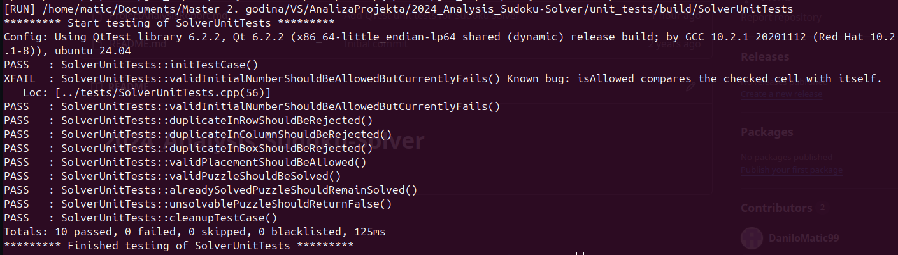
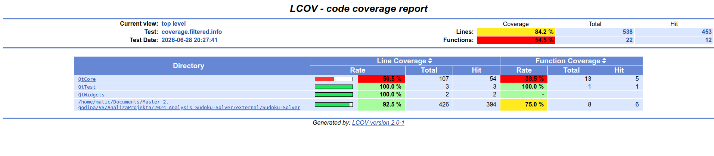
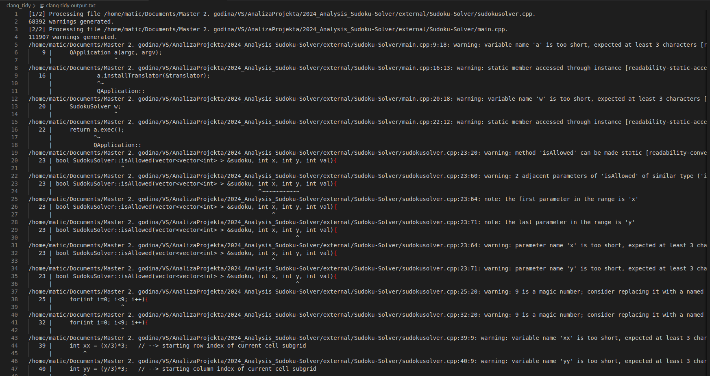

# Izveštaj analize projekta

## Testiranje i pokrivenost koda

Za testiranje projekta korišćen je **QtTest** framework, jer je analizirani projekat implementiran u C++ jeziku uz Qt biblioteku. Testovi su smešteni u direktorijum `unit_tests`, dok je originalni projekat zadržan neizmenjen u direktorijumu `external/Sudoku-Solver`.

### Pokretanje testova

Testovi se pokreću python skriptom:

```bash
python3 unit_tests/run_tests.py
```

### Testirani slučajevi

| Test | Opis |
|---|---|
|`duplicateInRowShouldBeRejected` | Proverava da li će se odbiti broj koji već postoji u tom redu. |
|`duplicateInColumnShouldBeRejected` | Proverava da li će se odbiti broj koji već postoji u toj koloni. |
|`duplicateInBoxShouldBeRejected` | Proverava da li će se odbiti broj koji već postoji u tom 3x3 boxu. |
|`validPlacementShouldBeAllowed` | Proverava da li validan broj može biti unet u prazno polje. |
|`validPuzzleShouldBeSolved` | Proverava da li solver uspešno rešava validnu Sudoku tabelu. |
|`alreadySolvedPuzzleShouldRemainSolved` | Proverava da li već rešena tabela ostaje neizmenjena. |
|`unsolvablePuzzleShouldReturnFalse` | Proverava da li  će nerešiva tabela biti odbijena. | 
|`validInitialNumberShouldBeAllowedButCurrentlyFails` | Dokumentuje grešku u funkciji `isAllowed()` gde prilikom provere da li se zadati broj nalazi u koloni/redu/bloku ne ignoriše trenutno polje koje se proverava. |

### Rezultat izvršavanja testova

Na slici ispod prikazan je rezultat izvršavanja testova.



### Pokrivenost Koda

Uz testove je praćena i pokrivenost koda pomoću alata **lcov**. Pokrivenost je merena nakon izvršavanja automatizovanih testova, tako da metrika predstavlja stvarno izvršene delove koda.

Izveštaj pokrivenosti generisan je komandama:

```bash
lcov --capture --directory unit_tests/build --output-file unit_tests/build/coverage.info
lcov --remove unit_tests/build/coverage.info '/usr/*' '*/unit_tests/*' --output-file unit_tests/build/coverage.filtered.info
genhtml unit_tests/build/coverage.filtered.info --output-directory unit_tests/coverage_html
```
Na slici ispod prikazan je HTML izveštaj alata `lcov`.



Visoka pokrivenost linija pokazuje da su testovi izvršili najveći deo algoritamskog koda. Funkcijska pokrivenost je niža jer nije pokrivena UI funkcija `solveSudoku()`, koja predstavlja Qt slot povezan sa korisničkim interfejsom.

## Statička analiza pomoću cppcheck alata

Za statičku analizu C++ koda korišćen je alat **cppcheck**. Analizitrani su ručno pisani fajlovi projekta:

```text
external/Sudoku-Solver/main.cpp
external/Sudoku-Solver/sudokusolver.cpp
external/Sudoku-Solver/sudokusolver.h
```

Automatski generisani Qt fajlovi, kao što su `moc_sudokusolver.cpp` i `ui_sudokusolver.h`, nisu ukljuceni u analizu jer ne predstavljaju izvorni kod projekta.

Analiza je pokrenuta sledećom skriptom:

```bash
#!/usr/bin/env bash

set -xe

SCRIPT_DIR="$(cd "$(dirname "${BASH_SOURCE[0]}")" && pwd)"
ROOT_DIR="$(cd "$SCRIPT_DIR/.." && pwd)"

cppcheck \
  --quiet \
  --inconclusive \
  --enable=all \
  --suppress=missingIncludeSystem \
  -DQ_OBJECT= \
  -Dslots= \
  -Dsignals= \
  --output-file="$SCRIPT_DIR/cppcheck-output.txt" \
  "$ROOT_DIR/external/Sudoku-Solver/main.cpp" \
  "$ROOT_DIR/external/Sudoku-Solver/sudokusolver.cpp" \
  "$ROOT_DIR/external/Sudoku-Solver/sudokusolver.h"

echo "finished cppcheck"
```

Zbog korišćenja Qt makroa, dodate su definicje `Q_OBJECT`, `slots` i `signals`, kako bi `cppcheck` mogao da analizira bez grešaka.

Dodatne opcije koje su korišćene prilikom analize:

- *--inconclusive* : alat prijavljuje i neodlučne greške (greške koje nije mogao da kategorizuje kao greške ili upozorenja i bez ove opcije ih ne bi uključio u izveštaj)
- *--enable=all* : alat uključuje sve dostupne provere koje može da izvrši
- *--suppress=missingIncludeSystem* : alat ignoriše greske koje se dobijaju iz header-a (kako bi se izbegao problem sa proveravanjem eksternih biblioteka koje se uključuju u header fajlovima)

## Rezultat analize

Cppcheck je prijavio sledeće upozorenje:

```text
../external/Sudoku-Solver/sudokusolver.h:17:5:
style: Class 'SudokuSolver' has a constructor with 1 argument that is not explicit. [noExplicitConstructor]
    SudokuSolver(QWidget *parent = nullptr);
    ^
```

Alat predlaže da konstruktor bude označen ključnom rečju `explicit`.

Ovo upozorenje ne predstavlja funckionalnu grešku u progeamu, već preporuku za bolji C++ stil.


## Statička analiza pomoću alata clang-tidy

Clang-Tidy predstavlja jedan od Clang zasnovanih alata koji obavlja statičku analizu koda (vrši analiziranje izvornog koda bez njegovog izvršavanja sa ciljem pronalaženja grešaka, poboljšanja kvaliteta koda i ispravljanja neoptimalno napisanih delova koda).

Za analizu su uključene grupe provera:

```text
bugprone-*
performance-*
readability-*
modernize-*
```

Skripta za pokretanje se nalazi u direktorijumu `clang_tidy`.

```bash
./clang_tidy/run_tidy.sh
```

Na slici ispod prikazan je deo rezultata alata `clang-tidy`, dok se u fajlu `clang-tidy-output.txt` nalazi celokupni izveštaj alata.



Clang-tidy je prijavio više upozorenja, od kojih su najznačajnija sledeća:

| Fajl | Nalaz |
|---|---|
|`sudokusolver.cpp` | `isAllowed` može biti `static` |
|`sudokusolver.cpp` | Implicitna koncerzija `bool->int->bool` |
|`sudokusolver.cpp` | `solveSudoku()` ima kongitivnu kompleksnost 34 |
|`sudokusolver.h` | Destruktor može biti označen sa `override` |

Primer ya implicitnu konverziju:

```cpp
int success = solvesudoku(sudoku, i, j+1); 
if(success){
  return true;
}
```
Bolje bi bilo da se koristi bool umesto int-a.

Zbog velike kompleksnosti solveSudoku() funkcije od 34, a prag je 25 bilo bi dobro da se razdvoji na više funkcija, pogotovo spojnost gui i logike u toj funkciji.

Alat je prijavio i veliki broj upozorenja iz Qt generisanog fajla `ui_sudokusolver.h`. Ti nalazi nisu analizirani detaljno, jer taj fajl nije ručno pisan, vec generisan od strange Qt-a.